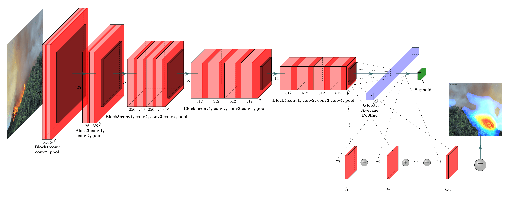

# Weakly Supervised Fire and Smoke Segmentation in Forest Images with CAM and CRF

## Abstract 

The number of publicly available datasets with annotated fire and smoke regions in wildfire scenarios is very scarce. To develop flexible models that can help firefighters protect the forest and nearby populations we propose a method for segmenting fire and smoke regions in images using only image-level annotations, i.e. simple labels that just indicate the presence or absence of fire and smoke . The method uses Class Activation Mapping (CAM) on multi-label classifiers of fire and smoke, followed by Conditional Random Fields (CRF) to accurately detect fire/smoke masks at the pixel-level. Due to the high correlation of fire and smoke labels, we found that a single classifier is unable to provide simultaneously good segmentation for fire and smoke. We propose the training of two classifiers of different complexities, one to support the segmentation of fire and the other for smoke. Compared with fully-supervised methods, the proposed weakly-supervised method is quite competitive, while requiring much less labeling effort in dataset preparation.

## Proposal 

## Labelling Method

## CAM

#### CAM approach

#### CAM heatmaps

## CRF

## Results

### Fire results

| Method    |       Approach    |   mIoU  | Standard Dev. |
| :---:     |       :---:       |   :---: |     :---:     |
| Method 1  | fully-supervised  |  0.856  |     0.073     |
| Proposed  | weakly-supervised |  0.735  |     0.142     |

### Smoke results

| Method    |      Approach     |  mIoU  | Standard Dev. |
| :---:     |        :---:      |  :---: |     :---:     |
| Method 1  | fully-supervised  |  0.771 |     0.157     |
| Proposed  | weakly-supervised |  0.760 |     0.149     |

## Models 

> https://drive.google.com/drive/folders/1RDAnKYQEwi4H3YsE_c_SsSeYvbFQfuDl?usp=sharing

